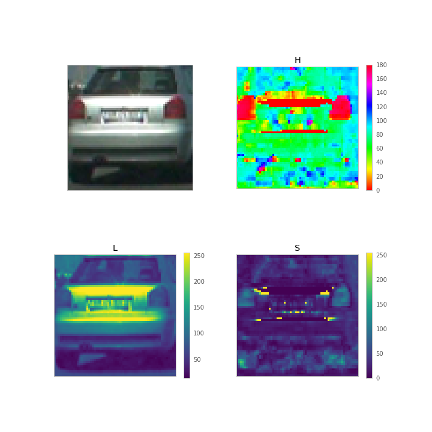
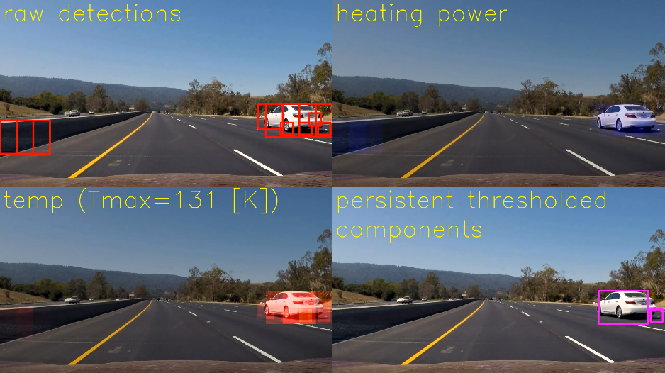

# Vehicle Detection

The goal of this project was to use classical computer vision methods (that is, not deep convolutional neural networks (CNN)) to detect and draw bounding boxes around vehicles which show up in footage from a hood-mounted camera. This can be reduced to a supervised classification task, in which image patches are classified as either "car" or "not-car". While, in a CNN approach, this scale/translation slewing (a covolution!) can be handled efficiently, with a network that directly outputs bounding boxes, or a detection heatmap, here, we make do with explicit windows.

Eliding some details, the classifier pipeline takes as input image patch, transforms from RGB to a more meaningful color space, computes higher-order features including color histograms and locally-binned histograms of oriented gradients (HOG), and then passes these to a radial basis function support vector classifier (RBF-SVC). Each detection window is added to a heat map over the entire image.

In order to encourage the surfacing of only persistent detections, this heat map is used in a simulated cooling process to produce a temperature map which evolves over multiple frames of video. The temperature map is thresholded to produce several disjoint regions, bounding boxes on which are taken to be the final detection bounding boxes.

## Training data
*Data is loaded by `vehicleDetection.data.getData`.*

While multiple sources of data were available, for simplicity I used only the GTI Vehicle Image Database[^gti], from the Technical University of Madrid. This is a collection of 64x64 color images of cars, vans, trucks, etc. seen on the roads of Madrid, Brussels, and Turin.

*(Image taken from [www.gti.ssr.ump.es](http://www.gti.ssr.upm.es/data/Vehicle_database.html).)*

Both positive (shown above) and negative examples are included, and positive examples are further divided into far, left, middle-close, and right categories, which might be an interesting expansion on the basic car/no-car categorization done here. The basic dataset provided includes 3,900 negative examples and 2,826 positive examples.

### Train/test split for GTI data
*The experiments described in this subsection are in `per-car data splitter.ipynb`.*

Because GTI images are extracted from larger 360x256 video frames, the exhibit some seqentiality. Often, runs of up to a dozen images that are clearly of the same car occur in sequence in the data.

Here, numbers after the colon are the file names of the images, minus the prefix "image" and postfix ".png". Transitions in these supplied indices are indicated in red while it's apparent that some vehicle transitions are noted this way, by no means are all.

The presense of runs of the same car is significant for assessing training progress--when creating a train/test split of the data, a naively random split will include portions of most runs in both parts of the split. Since many images are very similar to others within their run, this will result in a testing dataset that is insufficiently different from the training set to provide a realistic idea of generalizability of results.

My first method for alleviating this problem, though unused, did provide some useful insight, and so I'll discuss it here. My goal was to detect these transitions, so that I could randomly assign whole runs to the train or test set. Using the color-histogram image featurization discussed below, I calculated the Euclidean feature distance between subsequent images. Simply thresholding these values was insufficient for separating same-car transitions from different-car, as visible by the evident difficulty of fitting a high-quality logistic regression to the feature distance data.

Instead, I considerd searching for local peaks in this signal, defined as distances which were a factor of 1.5 larger than the median of their radius-3 neighborhood to right and left.

Here, "true" transitions were found for the first 200 or so images by manual inspection, marked by black vertical lines. Red dashed lines correspond to jumps in the indexing implied by the image file names, while magenta lines are local peaks of the signal. This method likely would have performed well enough to produce an adequate train/test split, or even many such splits, suitable for automated k-fold cross validation when performing a grid search for parameter values (see below).

However, rather taking the time to write the data generator necessary to make full use of these splits for cross validation, for the purposes of once-off classifier validation, I instead simply used the first ~90% of the image from each class as training data, and the last ~10% as testing.

## Featurization
*Featurization is performed by `vehicleDetection.features.FeatureExtractor`.*

The first step in featurization of the image patches here was transformation to a more meaningful color space. While the default red-green-blue encoding of ingested images is sufficient for storage, the red, green, and blue channels for individual pixels are highly correlated, inhibiting parsimony in any classifier that uses these features. One way to see this is in the similarity of the mean red, green, and blue channels.

Instead, I used the hue-lightness-saturation colorspace, in which different information is more readily available in the three channels. While extensive variation in the H and S channels makes the mean images uninterpretable, they are distinct from the mean L image.

Viewed on an individual image, however, the H and S channels  clearly pick out the taillights of a car, while the L channel shows the horizontal shape of its trunk and bumper.

In addition to the raw HLS pixel values, I used histogram of oriented gradient (HOG) features on each of the HLS channels. This method divides the image into cells a few pixels wide (usually 8x8 for my purposes), then allows each pixel to vote for one of a small number of orientations (here, usually 9). These votes are weighted by the strength of the gradient at that pixel, to produce a histogram of gradient directions within that cell. After a normalization involving several neighboring cells, these histograms are concatenated into a contribution towards the feature vector.

Visualized in the aggregate, the average HLS image shows a strong horizontal edge at the top of the L channel on positive-class images. At the moment, my classifiers all seem to rely heavily on this feature, perhaps to the exclusion of light-colored cars (whose upper edge gradient might be reversed in direction).

Finally, I used scikit-learn's `StandardScalar` to scale features before use with my classifier, as the support vector machine is sensitive to the scale of the individual features.

### Data augmentation.
*Data augmentation is performed in the second half of `vehicleDetection.data.getData`.*

Since the GTI data seems to be generally lower-resolution and darker European images, compared the gloriously sunny high-resolution southern California video of the test videos, I was initially quite concerned that the simple distribution of pixel values would be quite different between the train/test and inference data. Below I show these distributions in HSV space, which is similar to the distribution in HSL.

*Distribution of training pixels.*

*Distribution of inference pixels.*

I was particularly concerned about the large gap in the 40-80 range of the H channel. However, upon examining the color that these values corespond to in the 180-double-degree encoding used by OpenCV, I was able to hand wave this as a preponderance of negative-class foilage images in the training data.

However, I was still concerned that the inference video frames seemed subjectively lighter than the training images, so I implemented a data agumentation scheme, whereby I converted some subset of the training images to HSV space, increased the V channel a random amount such than no pixel's V channel was allowed to go over 255, then converted back to RGB.

Additionally, I did some simple left-right flip augmentation.

It's not clear to me that this augmentation necessarily improved the classification results, but it certainly did make training slower.

### HOG reuse and sliding windows
*HOG resuse is computed in `vehicleDetection.features.breakIntoWindows`.*

While HOG features were generated from scratch each time for training images, in order to save time and memory during inference, I developed a method to generate HOG features across the whole image only once, reusing this for all translated and scaled image windows. While this slightly tightened the coupling of the code, in combination of vectorization of the inference operation, this produced a 10x speedup at test time.

When called with `feature_vector=False, orient=9, pixels_per_cell=8`, and `cells_per_block=2`, the featurizer of `skimage.feature.hog` returns a `feature_array` of shape `(nx, ny, 2, 2, 9)`, where the `nx` and `ny` components represent the number of times the `cells_per_block` by `cells_per_block` normalization block can be translated across the image in steps of once cell.

To pregenerate my HOG features, I first took horizontal-slice regions-of-interest from my input frames, then expressed my goal image-patch radius for each slice (e.g. 128), as well as fractional overlap between patches (e.g. 0.5). I scaled the slices up or down such that the desired patch sizes were mapped to the 64x64 size of my training patches, and applied `skimage.feature.hog`. 

I then found indexes into the first two dimensions of `feature_array` such that 64x64 patches of the desired fractional overlap were approximately achieved, considering the stride pattern of the normalization blocks. Unrestricted use of the parameters for `skimage.feature.hog` will prevent the number and size (when mapped back to video pixel space) of the windows generated this way from being exactly as requested. However, they will map consistently to patches of the same number of HOG features, meaning our classifier (trained on 64x64 patches) will still work. As a final step, I computed the resulting indexes into the original image, and also returned windowed views of that image for computing raw-pixel (or color histogram) features.

As a special case, a goal of a 64x64 (unscaled) window, applied to a full-height "slice" of a 64x64 input image produces only a single window and the HOG features thereof. This allowed me to use the same code at train and test time.

All featurization code is contained in a single `FeatureExtractor` class, whose `__call__` method dispatches between the 64x64 single-window special-case and the large-frame, many-window inference case; returning feature vector or array of feature vectors, accompanied by window boundaries, as appropriate.

## Classification
*Classification is performed by `vehicleDetection.detector.Detector`.*

Though perhaps it was a premature decision, I quickly settled on a RBF-SVC as my classification method, as this seemed to provide equal-quality results to a linear-kernel SVC or a decision tree on my initial tests, with better speed than the second and surprisingly similar speed to the first.

I used `sklearn`'s built-in cross-validated grid search to find values for the $C$ and $\gamma$ parameters of the RBF-SVC. A more careful approach would include the choice among the three classifiers in this grid search (which might need to become a random hyperparameter search, or a more sophisticated Bayesian hyperparameter search, as the dimension of the hyperparameter space grows). Additionally, due to the sequential nature of the data discussed above, the validation errors used for this search should be taken with a massive grain of salt. Really, the method described in the "train/test split for GTI data" section above should be used for generating the train-test splits needed for the k-fold cross-validation strategy used by `sklearn`.

Regardless, this search *did* enable met to find a workable region of the $C\times\gamma$ space in which the classifier wouldn't completely collapse to predicting all one class or the other.

With in all the `sklearn` SVC kernels (linear, RBF, and polynomial), the $C$ parameter represents the penalty on misclassifications (or, more accurately, violations of the margin constraint). Using a high value will results in a more convoluted classification surface with a smaller margin. This smaller margin usually results in fewer support vectors[^so], which can help with runtime (which appears to be mainly linear in the number of support vectors). However, increasing C too far will result in overfitting.

For the RBF kernel, the $\gamma=1/\epsilon^2$ parameter is equal to the inverse square of the bandwidth parameter $\epsilon$ in the Gaussian kernel $exp(-||x_1 - x_2||^2 / \epsilon^2)$. As such, it can be thought of as the typical length scale in the feature space at which we discern structures. This way of thinking of $\gamma$ is connected the similar use of the kernel trick in diffusion maps[^dmaps], where the kernel expansion form of the feature vectors which is only implicitly present for support vector machines is in fact computed explicitly.

In diffusion maps, we consider performing a random walk on the feature-space representation of the data, where probability of transitions is governed by closeness in feature space, where the nonliear stretching of the Gaussian kernel pushes large distances to infinity in comparison to distances on the order of $\epsilon$. The eigenvectors of the diffusion operator on this data geometry--the archetypical directions of the heat diffusion represented by this random walk--then constitute a lower-dimensional, hopefully more meaningful representation of the data. With the SVC, these diffusion coordinates are not computed explictly, but a linear classifier is implicitly formed in the (infinite-dimensional) full diffusion-coordinate space.

As such, using a small value of $\gamma$ (and therefore a large value for $\epsilon$) is like taking a birds-eye view of the data manifold, which ignores fine distinctions betwen feature vectors. As such, it should tend to underfit the data, while a large value of $\gamma$ will produce a classifier which is preoccupied with fine distinctions in the data--in the limit as $\gamma$ increases, the classifier should be unable to generalize at all, believing that the ideal interpretation of the data is that each and every feature vector should be considered a perfectly unique class all to itself. This prediction arises from the analogy to spectral clustering[^specClust], which is an interpretation of these spectral methods for the unsupervised task of predicting (without known classes) the number and memberships of classes implied by the data.

## Reducing outliers and tracking persistent detections
*Detection persistence is determined by `vehicleDetection.temporal.HeatVideo`, and the temperature image effect is computed in `vehicleDetection.temporal.cooling`.*

When applied to an frame sequence from video, the pipeline described above produced many false positive window detections that may only last for a single frame, but generally produced multiple detections at different scales on and around true cars. To emphasize these persistent true-positive detections, I extended the "heatmap" analogy for the output from the detector with an application of Newton's law of cooling with a heat source.

Specifically, I summed the detection windows for the video frame at timestep $t$ to produce a "heating power" image $h(t)$, to which I assigned units of detections. I initialized a temperature image $u(t)$ (units of Kelvins) as all zeros at the start of the video. I then computed the warming rate of this image as
$$\dot u = \frac{\gamma A (0 - u(t)) + \phi h(t)}{\beta},$$
where $\gamma = 1 [\frac{W}{m^2 K}]$ is the heat transfer coefficient, $A=1 [m^2]$ is the imagined surface area of each pixel, $\phi = 20 [W/\mathrm{detection}]$ is the heating power of one detection, and $\beta = 20 [J/K]$ is the heat capacity of a pixel.

I then "simulated" this ODE by taking one Euler timestep for each frame, with an assumed duration of 1 second per frame. Negative temperatures (an artifact of this coarse timestepping) were clipped to zero after each Euler step.

While a simpler, more ad-hoc scheme might have also worked, the physical analogy was appealing to me.

## Results
*Videos are generated by `vehicleDetection.temporal.HeatVideo.video`.*

*A representative frame of output.*

Diagnostic video for the project input video are visible at https://youtu.be/8OE3bXGQkXk.

<iframe width="560" height="315" src="https://www.youtube.com/embed/8OE3bXGQkXk?rel=0&loop=1&playlist=8OE3bXGQkXk&modestbranding=1&showinfo=0" frameborder="0" allow="autoplay; encrypted-media" allowfullscreen></iframe>

Additionally, results for the test video are at https://youtu.be/9ZGxnX5UF6I.

<iframe width="560" height="315" src="https://www.youtube.com/embed/9ZGxnX5UF6I?rel=0&loop=1&playlist=9ZGxnX5UF6I&modestbranding=1&showinfo=0" frameborder="0" allow="autoplay; encrypted-media" allowfullscreen></iframe>

While a more aggressive temperature threshold might be possible on the project video, the existing temperature threshold produces many false positives on the test video, especially when the road surface transitions from asphalt to concrete. I believe this road surface transition triggers the previously mentioned sharp-horizontal line detection. As many of the cars in the training set were darkly painted on a relatively light background, the classifier latched on to this falling horizontal edge as a strong predictor for the car class. It's possible that using more varied data would help with this problem, or maybe changing the regularization, perhaps by increasing C to allow for more features to be selected.

## Conclusion and future work

My classifier produced many false positives. It would probably help a lot if I did more tweaking on my feature generation, and perhaps also on my classifier. Early on, I experimented with using not the predictions from the classifier, but the value of the classifiers decision function as the additive value for generating my heating-power map. While it seemed at the time that the decision function values did not correlate well with what I expected the confidence of the predictions to be, this approach might still be useful by setting a threshold other than 0 for this decision function.

In order to control runtime, I attempted to use C to control the number of support vectors used. One possible alternative would be to consider `sklearn.svm.NuSVC`, which uses an extra parameter specifically to control the number of support vectors. However, `NuSVC` lacks the $C$ parameter, so it's unclear to me how my intuition about how $C$ affects performance can be transferred to the $\nu$ parameter of the `NuSVC`.

## References

[^gti]: [*GTI Vehicle Database*](http://www.gti.ssr.upm.es/data/Vehicle_database.html)
[^so]:  [*SVM: Why does the number of support vectors decrease when C is increased?*](https://stats.stackexchange.com/questions/270187)
[^dmaps]: [Coifman, R. R., & Lafon, S. (2006). *Diffusion maps.* Applied and Computational Harmonic Analysis, 21(1), 5–30.](http://doi.org/10.1016/j.acha.2006.04.006)
[^specClust]: [Luxburg, U. (2007). *A tutorial on spectral clustering.* Statistics and Computing, 17(4), 395–416.](http://doi.org/10.1007/s11222-007-9033-z)